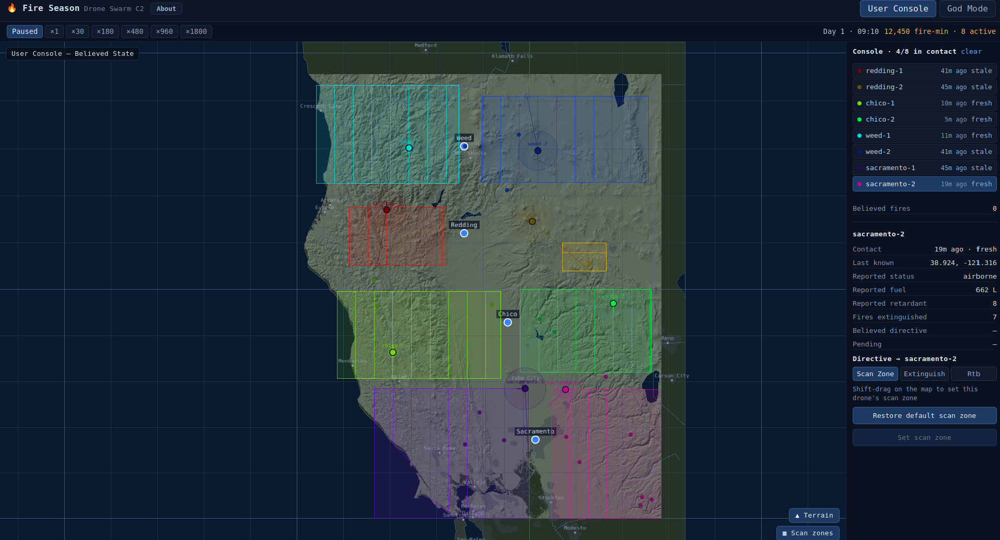

# Fire Season — Drone Swarm C2

A browser demo of an **intent-based command console for an autonomous drone swarm**,
built around one idea: *the console is a lens, never in the control loop, and stale
data is never rendered as if it were live.*

Eight autonomous drones fight a 30-day wildfire season across Northern California.
Operators issue **intent** (scan this area, extinguish that fire, return to base) — not
micro-commands — and the swarm keeps flying, detecting, and dousing fires on its own
even when the console link goes dark. Two tabs make the gap between belief and reality
literal:

- **God Mode** — the authoritative ground truth: every drone, every fire, right now.
- **User Console** — only what the operator *believes*, assembled from intermittent
  radio syncs: last-known positions, dead-reckoned ghosts, staleness cues, and drones
  that have gone **MISSING** during a comms blackout.

Watch a blackout roll in and the console's picture drift away from the truth — then snap
back when the drone reconnects. That divergence is the whole point.

## Live demo

**▶ [Try it in your browser](https://benbatya.github.io/drone_swarm_demo/)** — no install,
runs fully client-side (offline basemap, no tiles or keys).

[](https://benbatya.github.io/drone_swarm_demo/)

## Quick start

```bash
npm install
npm run dev            # http://localhost:5173
```

The map runs fully offline (flat basemap, no tiles/keys). Press ▶, bump the speed to
×60, and watch a season play out in ~12 minutes (or faster).

## Scripts

| command | what it does |
|---|---|
| `npm run dev` | Vite dev server |
| `npm test` | headless sim unit tests (vitest) |
| `npm run build` | typecheck + production build |
| `npm run test:e2e` | Playwright browser smoke test (boots the built app) |

## Demo walkthrough

1. **God Mode**, press ▶ and set **×16/×60**. Fires ignite (orange); drones (cyan)
   patrol out from the four bases, each ringed by its 50 km detection radius.
2. Watch the fleet **autonomously** self-assign the nearest known fire and douse it;
   when fuel or retardant runs low a drone **forced-RTBs**, docks for turnaround, and
   relaunches. The score badge tracks total **fire-minutes burned**.
3. Switch to the **User Console**. The picture is thinner — the console only knows what
   drones have *reported*. Some drones show amber **stale** rings with a dead-reckoned
   ghost drifting along their last heading; a drone in a deep outage goes red
   **MISSING**, frozen at its last-known spot.
4. In the console, pick a drone, choose **Scan**, and **shift-drag a rectangle** on the
   map. Issue it. It appears as *pending* → the drone **downloads** it at its next sync
   (watch the checkmark), then flies the lawnmower pattern.
5. Select a fire the console knows about and issue an **Extinguish**; or send a drone
   **RTB**. Higher-importance directives preempt what a drone is doing.
6. Back in **God Mode**, open the config panel to change the **ignition rate**, **seed**,
   **fleet size**, or **deep-outage chance**, then **Apply & restart**. Select a drone to
   see its **comms timeline** (connected / routine / deep-outage windows).
7. Let the 30 days run out for the **end-of-season summary**: fire-minutes burned and the
   fraction of fires doused.

## Architecture

- **`src/sim/`** is pure TypeScript, zero React, fully headless-testable. One `tickWorld`
  advances the authoritative `GroundTruth` by one sim-minute:
  ignition → drone decisions/kinematics/fuel/crash → detection → **gossip** → **sync** →
  scoring.
- Three tiers of state: **GroundTruth** (authoritative) · **DroneBelief** (per-drone: own
  detections + peer gossip) · **ConsoleBelief** (only successful syncs + operator input).
  The `comms/` module is the *only* code that reads truth and writes console belief —
  enforced by a belief-isolation test.
- **Comms & staleness.** A drone attempts a console sync every **32 sim-min**; while
  blacked out it re-polls at a short constant interval (`syncRetryMin`, 3 min) so it
  reconnects within a couple of minutes of the link returning — no decreasing backoff that
  could sleep through a connected window. Blackouts are per-drone alternating
  connected/dark windows (~40–60% dark): mostly short **routine** outages (≤40 min) plus
  rare **deep outages** (80–220 min). The console derives staleness from last-contact age:
  **fresh** → **stale** (amber, dead-reckoned ghost past 40 min) → **MISSING** (red). The
  MISSING threshold (**76 min**) sits above the worst-case routine-blackout contact gap
  (~75 min = ≤32 min staleness + ≤40 min dark + ≤3 min re-poll) and below the shortest
  deep outage (80 min), so **MISSING means a genuine deep outage or a crash — never
  routine blackout flicker.**
- **`simRunner.ts`** owns the single `requestAnimationFrame` loop (speed/pause
  accumulator), rebuilds a pooled snapshot per frame for the imperative **deck.gl** map,
  and notifies React panels through a throttled store.
- Determinism comes from a seeded PRNG (mulberry32); the same seed replays an identical
  season, comms and all.

**Stack:** Vite · React · TypeScript · MapLibre GL + deck.gl · zustand · vitest ·
Playwright.

The full design and milestone plan lives in
[`plans/implementation_plan.md`](plans/implementation_plan.md).
